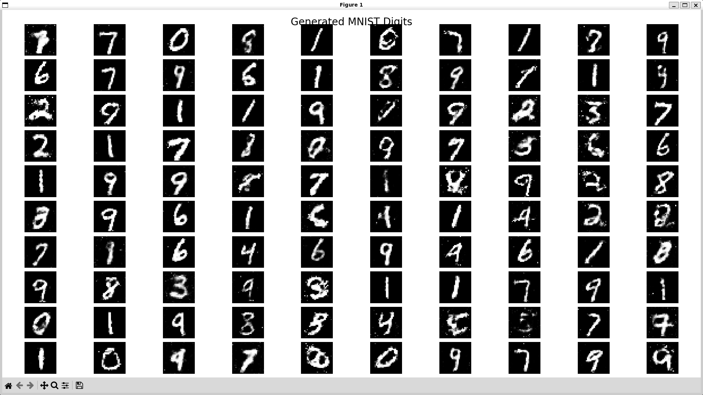

# 🎨 Simple GAN for MNIST Digit Generation

A PyTorch implementation of a Generative Adversarial Network (GAN) that learns to generate handwritten digits similar to the MNIST dataset. This project demonstrates the fundamental concepts of adversarial training with GPU acceleration support.


---

## 📋 Table of Contents

- [Overview](#overview)
- [What This Project Does](#what-this-project-does)
- [Project Workflow](#project-workflow)
- [How GANs Work](#how-gans-work)
- [Features](#features)
- [Requirements](#requirements)
- [Installation](#installation)
- [Project Structure](#project-structure)
- [Usage](#usage)
- [Training Details](#training-details)
- [Results](#results)
- [Troubleshooting](#troubleshooting)
- [Advanced Configuration](#advanced-configuration)
- [Contributing](#contributing)
- [License](#license)
- [References](#references)

---

## 🎯 Overview

This project implements a **simple feedforward GAN** (Generative Adversarial Network) to generate handwritten digit images. The model consists of two neural networks:

- **Generator** 🎨: Creates fake images from random noise vectors
- **Discriminator** 🔍: Distinguishes between real MNIST images and generated fakes

Through adversarial training, the Generator learns to produce increasingly realistic digits that can fool the Discriminator.

### Key Highlights

- ✅ Simple and easy-to-understand architecture
- ✅ Automatic CUDA/GPU acceleration
- ✅ Real-time training visualization
- ✅ Checkpoint saving and resuming
- ✅ Clean, well-documented code
- ✅ Beginner-friendly implementation

---

## 💡 What This Project Does

This MNIST GAN project accomplishes the following:

### Core Functionality

1. **Learns from Real Data**: Downloads and processes the MNIST dataset containing 60,000 handwritten digit images
2. **Trains Two Competing Networks**: 
   - Generator creates fake digits from random noise
   - Discriminator learns to distinguish real from fake digits
3. **Generates New Digits**: After training, the Generator can create unlimited unique, realistic-looking handwritten digits
4. **Saves Progress**: Automatically saves training checkpoints and generated sample images throughout training
5. **Visualizes Results**: Creates image grids showing the quality improvement of generated digits over time

### Use Cases

- **Educational**: Learn how GANs work through a simple, well-documented implementation
- **Data Augmentation**: Generate additional training data for digit recognition tasks
- **Creative**: Produce unique handwritten digit artwork or animations
- **Research**: Serve as a baseline for more advanced GAN experiments
- **Prototyping**: Quick starting point for similar image generation projects

---

## 🔄 Project Workflow

Here's the complete workflow from setup to generation:

```
┌─────────────────────────────────────────────────────────────────────┐
│                        PROJECT WORKFLOW                              │
└─────────────────────────────────────────────────────────────────────┘

1. SETUP PHASE
   ├── Install dependencies (PyTorch, torchvision, matplotlib)
   ├── Download MNIST dataset (automatic on first run)
   └── Initialize GPU/CPU device

2. TRAINING PHASE (train_gan.py)
   ├── Initialize Generator & Discriminator networks
   ├── Load MNIST data in batches
   ├── For each epoch:
   │   ├── Train Discriminator on real + fake images
   │   ├── Train Generator to fool Discriminator
   │   ├── Log losses
   │   └── Every 5 epochs:
   │       ├── Save checkpoint to checkpoints/
   │       └── Generate sample images to results/
   └── Save final model and images

3. GENERATION PHASE (generate.py)
   ├── Load trained model from checkpoint
   ├── Generate random noise vectors
   ├── Feed noise through Generator
   ├── Create image grids
   └── Save generated samples to results/

4. ANALYSIS PHASE
   ├── Review training progress images
   ├── Compare epoch 5 vs epoch 50 quality
   ├── Check architecture diagrams in resources/
   └── Analyze loss curves
```

### Detailed Step-by-Step Flow

**Step 1: Data Preparation**
- MNIST images are normalized to [-1, 1] range
- Images flattened from 28×28 to 784-dimensional vectors
- Batched into groups of 64 for efficient training

**Step 2: Adversarial Training Loop**
```
For each batch:
├── Discriminator Training:
│   ├── Show real MNIST images (label: 1 = real)
│   ├── Generate fake images from noise (label: 0 = fake)
│   ├── Discriminator learns to classify both
│   └── Update Discriminator weights
│
└── Generator Training:
    ├── Generate new fake images
    ├── Get Discriminator's opinion on fakes
    ├── Generator tries to maximize "real" score
    └── Update Generator weights
```

**Step 3: Quality Improvement**
- Early epochs: Blurry, unrecognizable shapes
- Mid epochs: Rough digit outlines emerge
- Late epochs: Clear, realistic handwritten digits

**Step 4: Deployment**
- Trained Generator can create unlimited new digits
- No Discriminator needed after training
- Fast generation: ~1000 images per second on GPU

---

## 🧠 How GANs Work

### The Game Theory Analogy

Think of a GAN as a game between two players:

1. **The Generator (Forger)** 🎨
   - Creates fake money (images)
   - Tries to make them look real
   - Learns from the Detective's feedback

2. **The Discriminator (Detective)** 🔍
   - Examines money to determine if it's real or fake
   - Gets better at spotting fakes over time
   - Forces the Forger to improve


*Diagram showing the complete GAN architecture with Generator and Discriminator*

### Training Process

```
                    ┌─────────────┐
                    │ Random Noise│
                    └──────┬──────┘
                           │
                           ▼
                    ┌─────────────┐
                    │  Generator  │ ← Learns to create realistic images
                    └──────┬──────┘
                           │
                   Fake Images
                           │
        ┌──────────────────┴──────────────────┐
        │                                      │
        ▼                                      ▼
┌───────────────┐                    ┌─────────────────┐
│  Real Images  │                    │  Fake Images    │
│  from MNIST   │                    │ from Generator  │
└───────┬───────┘                    └────────┬────────┘
        │                                      │
        └──────────────┬───────────────────────┘
                       │
                       ▼
              ┌─────────────────┐
              │ Discriminator   │ ← Learns to detect fakes
              └────────┬─────────┘
                       │
                       ▼
              Real (1) or Fake (0)?
```

### Mathematical Foundation

**Generator Loss:**
```
L_G = -log(D(G(z)))
```
Goal: Maximize the probability that the Discriminator classifies fake images as real.

**Discriminator Loss:**
```
L_D = -[log(D(x)) + log(1 - D(G(z)))]
```
Goal: Correctly classify real images as real (1) and fake images as fake (0).


*Visual showing how generated digits improve from epoch 5 to epoch 50*

---

## ✨ Features

- **Automatic Dataset Download**: MNIST dataset is downloaded automatically on first run
- **GPU Acceleration**: Automatic CUDA detection and utilization
- **Progress Visualization**: Generated samples saved every 5 epochs
- **Checkpoint System**: Save and resume training from any epoch
- **Memory Efficient**: Optimized batch processing
- **Extensible Architecture**: Easy to modify for other datasets
- **Clean Code**: Well-commented and follows best practices

---

## 📦 Requirements

### System Requirements

- **OS**: Linux, macOS, or Windows
- **Python**: 3.8 or higher
- **RAM**: 4GB minimum (8GB+ recommended)
- **Storage**: ~200MB for dataset and checkpoints
- **GPU** (Optional but recommended): NVIDIA GPU with CUDA support

### Software Dependencies

```
torch>=2.0.0
torchvision>=0.15.0
matplotlib>=3.5.0
numpy>=1.21.0
```

### CUDA Support

For GPU acceleration, ensure you have:
- NVIDIA GPU (GTX 10 series or newer recommended)
- CUDA Toolkit 11.8 or 12.1
- cuDNN (usually comes with PyTorch)

Check CUDA availability:
```bash
python -c "import torch; print(f'CUDA Available: {torch.cuda.is_available()}')"
```

---

## 🚀 Installation

### Step 1: Clone or Download the Repository

```bash
# If using git
git clone https://github.com/yourusername/simple-gan-mnist.git
cd simple-gan-mnist

# Or simply create a new directory
mkdir gan_project && cd gan_project
```

### Step 2: Install Dependencies

**Option A: Using pip**
```bash
pip install -r requirements.txt
```

**Option B: Using conda**
```bash
conda create -n gan_env python=3.9
conda activate gan_env
pip install -r requirements.txt
```

**Option C: Install with CUDA support**
```bash
# For CUDA 11.8
pip install torch torchvision --index-url https://download.pytorch.org/whl/cu118

# For CUDA 12.1
pip install torch torchvision --index-url https://download.pytorch.org/whl/cu121

# Install remaining packages
pip install matplotlib numpy
```

### Step 3: Verify Installation

```bash
python -c "import torch; print(f'PyTorch: {torch.__version__}'); print(f'CUDA: {torch.cuda.is_available()}')"
```

Expected output:
```
PyTorch: 2.0.1
CUDA: True
```

---

## 📁 Project Structure

```
gan_project/
│
├── README.md                 # This file - Complete documentation
├── requirements.txt          # Python dependencies list
├── train_gan.py             # Main training script - Runs GAN training
├── generate.py              # Generate images from trained model
│
├── .github/                 # GitHub specific files
│   └── copilot-instructions.md  # Instructions for GitHub Copilot
│
├── dataset/                 # Auto-created on first run
│   └── MNIST/               # MNIST dataset storage
│       ├── raw/             # Downloaded dataset files (60,000 images)
│       └── processed/       # Preprocessed tensors for faster loading
│
├── resources/               # Documentation resources and visual aids
│   ├── gan_architecture_diagram.png    # Network architecture visualization
│   ├── training_progression.png        # Quality improvement over epochs
│   ├── generator_network.png           # Detailed Generator architecture
│   ├── discriminator_network.png       # Detailed Discriminator architecture
│   ├── loss_curves.png                 # Training loss visualization
│   └── sample_outputs/                 # Example generated images
│       ├── epoch_05_samples.png
│       ├── epoch_25_samples.png
│       └── epoch_50_samples.png
│
├── results/                 # Auto-created: Generated images during training
│   ├── epoch_5.png          # 8×8 grid of generated digits at epoch 5
│   ├── epoch_10.png         # Generated samples at epoch 10
│   ├── epoch_15.png         # Generated samples at epoch 15
│   ├── ...                  # Progressive improvement visible
│   ├── epoch_50.png         # Final training results
│   ├── final_generated.png  # Best quality samples
│   └── generated_samples.png # Output from generate.py (10×10 grid)
│
└── checkpoints/             # Auto-created: Model checkpoints for resuming
    ├── checkpoint_epoch_5.pth     # Model state at epoch 5
    ├── checkpoint_epoch_10.pth    # Model state at epoch 10
    ├── checkpoint_epoch_15.pth    # Model state at epoch 15
    └── checkpoint_epoch_50.pth    # Final trained model (use this!)
```

### Folder and File Descriptions

#### Core Scripts

- **`train_gan.py`**: Main training script that:
  - Initializes Generator and Discriminator networks
  - Loads MNIST dataset
  - Runs adversarial training loop for 50 epochs
  - Saves checkpoints and sample images every 5 epochs
  - Prints training progress and loss values

- **`generate.py`**: Post-training image generation script that:
  - Loads a trained Generator from checkpoint
  - Creates random noise vectors
  - Generates 100 new digit images
  - Displays them in a 10×10 grid
  - Saves output to results/

- **`requirements.txt`**: Lists all Python package dependencies with version requirements

- **`README.md`**: This comprehensive documentation file

#### Data and Output Directories

- **`dataset/`**: Automatically created directory for MNIST data
  - Downloads on first run (~12MB)
  - Contains 60,000 training images + 10,000 test images
  - Preprocessed tensors stored for faster subsequent runs

- **`results/`**: Contains all generated image outputs
  - Progress snapshots saved every 5 epochs
  - Final high-quality generated samples
  - Image grids for easy visualization
  - Use these to track training quality improvement

- **`checkpoints/`**: Stores model state dictionaries
  - Includes Generator weights, Discriminator weights
  - Also saves optimizer states for perfect resuming
  - Each checkpoint is ~2-3MB
  - Can resume training from any saved epoch

- **`resources/`**: Documentation and reference materials
  - Architecture diagrams for understanding network structure
  - Sample outputs demonstrating expected results
  - Training progression visualizations
  - Loss curve examples for comparison
  - Reference these when learning or troubleshooting

#### Configuration Files

- **`.github/copilot-instructions.md`**: Instructions for GitHub Copilot integration (optional)

---

## 🎮 Usage

### Basic Training

Run the training script with default settings:

```bash
python train_gan.py
```

### What Happens During Training

1. **Initialization** (First run only)
   - Downloads MNIST dataset (~12MB)
   - Creates necessary directories (dataset/, results/, checkpoints/)
   - Initializes models on GPU/CPU

2. **Training Loop**
   - Trains for 50 epochs (configurable)
   - Prints loss every 5 epochs
   - Saves generated images every 5 epochs to `results/`
   - Saves model checkpoints to `checkpoints/`

3. **Output**
   ```
   Using device: cuda
   GPU: NVIDIA GeForce RTX 3080
   Generator parameters: 533,776
   Discriminator parameters: 533,777
   
   ==================================================
   Starting Training Loop...
   ==================================================
   
   Epoch [5/50] | Loss D: 0.6234 | Loss G: 0.8912
   Epoch [10/50] | Loss D: 0.5821 | Loss G: 1.0234
   Epoch [15/50] | Loss D: 0.6102 | Loss G: 0.9456
   ...
   ```

### Generating New Images

After training, generate new digits:

```bash
python generate.py
```

This will:
- Load the trained model from the latest checkpoint
- Generate 100 new digit images
- Display them in a 10×10 grid
- Save to `results/generated_samples.png`

### Resume Training from Checkpoint

Modify `train_gan.py` to resume training:

```python
# Add this after model initialization
checkpoint = torch.load('checkpoints/checkpoint_epoch_30.pth')
gen.load_state_dict(checkpoint['gen_state_dict'])
disc.load_state_dict(checkpoint['disc_state_dict'])
opt_gen.load_state_dict(checkpoint['opt_gen_state_dict'])
opt_disc.load_state_dict(checkpoint['opt_disc_state_dict'])
start_epoch = checkpoint['epoch'] + 1

# Update the training loop
for epoch in range(start_epoch, num_epochs):
    # ... rest of training code
```

### Viewing Resources

Check the `resources/` folder to:
- Understand network architecture: `gan_architecture_diagram.png`
- See expected training progression: `training_progression.png`
- Compare your results with sample outputs: `sample_outputs/`
- Analyze loss curves: `loss_curves.png`

---

## 🎓 Training Details

### Model Architecture


*Detailed Generator network structure*

**Generator**
```
Input: Random noise vector (64 dimensions)
   ↓
Linear(64 → 256) + ReLU
   ↓
Linear(256 → 512) + ReLU
   ↓
Linear(512 → 784) + Tanh
   ↓
Output: Image (28×28 pixels)
```


*Detailed Discriminator network structure*

**Discriminator**
```
Input: Image (28×28 = 784 pixels)
   ↓
Linear(784 → 512) + LeakyReLU(0.2)
   ↓
Linear(512 → 256) + LeakyReLU(0.2)
   ↓
Linear(256 → 1) + Sigmoid
   ↓
Output: Probability (0=Fake, 1=Real)
```

### Hyperparameters

| Parameter | Value | Description |
|-----------|-------|-------------|
| Learning Rate | 0.0002 | Adam optimizer learning rate |
| Beta1 | 0.5 | Adam momentum parameter |
| Beta2 | 0.999 | Adam momentum parameter |
| Batch Size | 64 | Images per training batch |
| Latent Dimension | 64 | Size of noise vector |
| Epochs | 50 | Total training epochs |
| Loss Function | Binary Cross Entropy | BCE Loss |

### Training Time

| Hardware | Approximate Time |
|----------|------------------|
| NVIDIA RTX 3080 | ~5 minutes |
| NVIDIA GTX 1060 | ~10 minutes |
| CPU (Intel i7) | ~30 minutes |
| CPU (Intel i5) | ~45 minutes |

### Memory Usage

- **GPU VRAM**: ~500MB - 1GB
- **System RAM**: ~2GB during training
- **Disk Space**: ~200MB (dataset + checkpoints)

---

## 📊 Results

### Training Progress Visualization

The quality of generated images improves over time. Check `resources/training_progression.png` for visual comparison.

**Epoch 5**: Noisy, random patterns
```
[Blurry, unclear shapes - see resources/sample_outputs/epoch_05_samples.png]
```

**Epoch 20**: Recognizable digit shapes
```
[Rough outlines of digits emerging]
```

**Epoch 50**: Clear, realistic digits
```
[Well-formed handwritten digits - see resources/sample_outputs/epoch_50_samples.png]
```


*Example of healthy training: balanced losses converging*

### Loss Interpretation

**Healthy Training:**
- Discriminator Loss: 0.5 - 0.7 (balanced)
- Generator Loss: 0.7 - 1.5 (learning)

**Warning Signs:**
- D_loss → 0: Discriminator too strong (Generator can't learn)
- D_loss → 1: Generator fooling Discriminator too easily (mode collapse)
- Losses oscillating wildly: Unstable training (reduce learning rate)

### Sample Outputs

Check the following locations for results:

1. **Training Progress**: `results/epoch_X.png` 
   - 8×8 grids showing improvement at epochs 5, 10, 15, 20, 25, 30, 35, 40, 45, 50

2. **Final Results**: `results/final_generated.png`
   - Best quality samples after complete training

3. **Generated Samples**: `results/generated_samples.png`
   - 10×10 grid created by `generate.py`

4. **Reference Samples**: `resources/sample_outputs/`
   - Example outputs showing expected quality at different epochs

---

## 🔧 Troubleshooting

### Common Issues and Solutions

#### 1. CUDA Out of Memory

**Error:**
```
RuntimeError: CUDA out of memory
```

**Solutions:**
```python
# Reduce batch size in train_gan.py
batch_size = 32  # or even 16
```

#### 2. Module Not Found Error

**Error:**
```
ModuleNotFoundError: No module named 'torch'
```

**Solution:**
```bash
pip install torch torchvision matplotlib numpy
```

#### 3. CUDA Not Available

**Error:**
```
Using device: cpu
```

**Solutions:**
- Check if you have an NVIDIA GPU: `nvidia-smi`
- Install CUDA-enabled PyTorch:
  ```bash
  pip install torch torchvision --index-url https://download.pytorch.org/whl/cu118
  ```
- Verify CUDA installation: `nvcc --version`

#### 4. Poor Quality Generated Images

**Symptoms:**
- Images look random even after 50 epochs
- All images look the same (mode collapse)
- Results don't match `resources/sample_outputs/`

**Solutions:**
1. Train longer (100-200 epochs)
2. Adjust learning rate:
   ```python
   lr = 0.0001  # Lower learning rate
   ```
3. Use label smoothing:
   ```python
   real_labels = torch.ones_like(disc_real) * 0.9  # Instead of 1.0
   fake_labels = torch.zeros_like(disc_fake) + 0.1  # Instead of 0.0
   ```
4. Compare your loss curves with `resources/loss_curves.png`

#### 5. Training Takes Too Long on CPU

**Solution:**
Consider using:
- Google Colab (free GPU)
- Kaggle Notebooks (free GPU)
- AWS/Azure GPU instances
- Reduce `num_epochs` to 20-30 for faster results

#### 6. Dataset Download Fails

**Error:**
```
HTTP Error 503: Service Unavailable
```

**Solution:**
Manually download MNIST from: http://yann.lecun.com/exdb/mnist/
- Place files in `dataset/MNIST/raw/`
- Set `download=False` in code

#### 7. Checkpoint File Not Found

**Error:**
```
FileNotFoundError: checkpoints/checkpoint_epoch_50.pth
```

**Solution:**
- Ensure training completed successfully
- Check `checkpoints/` directory for available epochs
- Update `generate.py` to use existing checkpoint:
  ```python
  checkpoint_path = 'checkpoints/checkpoint_epoch_45.pth'  # Use available epoch
  ```

---

## ⚙️ Advanced Configuration

### Modify Hyperparameters

Edit `train_gan.py`:

```python
# Experiment with these values
lr = 0.0001              # Lower = more stable, slower
batch_size = 128         # Higher = faster, needs more VRAM
z_dim = 128              # Higher = more expressive generator
num_epochs = 100         # Train longer for better results
```

### Add Learning Rate Scheduling

```python
from torch.optim.lr_scheduler import StepLR

# After optimizer initialization
scheduler_gen = StepLR(opt_gen, step_size=30, gamma=0.5)
scheduler_disc = StepLR(opt_disc, step_size=30, gamma=0.5)

# In training loop (after optimizer.step())
scheduler_gen.step()
scheduler_disc.step()
```

### Monitor Training with TensorBoard

```python
from torch.utils.tensorboard import SummaryWriter

writer = SummaryWriter('runs/gan_experiment')

# In training loop
writer.add_scalar('Loss/Generator', loss_g.item(), epoch)
writer.add_scalar('Loss/Discriminator', loss_d.item(), epoch)
writer.add_images('Generated', fake, epoch)

# View with: tensorboard --logdir=runs
```

### Use Convolutional Layers (DCGAN)

For better image quality, upgrade to convolutional architecture. Reference `resources/gan_architecture_diagram.png` for guidance:

```python
class Generator(nn.Module):
    def __init__(self):
        super().__init__()
        self.main = nn.Sequential(
            nn.ConvTranspose2d(z_dim, 256, 7, 1, 0, bias=False),
            nn.BatchNorm2d(256),
            nn.ReLU(True),
            nn.ConvTranspose2d(256, 128, 4, 2, 1, bias=False),
            nn.BatchNorm2d(128),
            nn.ReLU(True),
            nn.ConvTranspose2d(128, 1, 4, 2, 1, bias=False),
            nn.Tanh()
        )
```

---

## 🤝 Contributing

Contributions are welcome! Here's how you can help:

### Ways to Contribute

1. **Report Bugs**: Open an issue with details
2. **Suggest Features**: Propose new ideas or improvements
3. **Submit Pull Requests**: Fix bugs or add features
4. **Improve Documentation**: Help make this README better
5. **Share Results**: Post your generated images in `resources/sample_outputs/`!
6. **Add Visual Resources**: Create diagrams or visualizations for the `resources/` folder

### Development Setup

```bash
# Fork and clone the repository
git clone https://github.com/yourusername/simple-gan-mnist.git

# Create a new branch
git checkout -b feature/your-feature-name

# Make changes and commit
git commit -m "Add: your feature description"

# Push and create a pull request
git push origin feature/your-feature-name
```

---

## 📄 License

This project is licensed under the MIT License.

```
MIT License

Copyright (c) 2025

Permission is hereby granted, free of charge, to any person obtaining a copy
of this software and associated documentation files (the "Software"), to deal
in the Software without restriction, including without limitation the rights
to use, copy, modify, merge, publish, distribute, sublicense, and/or sell
copies of the Software, and to permit persons to whom the Software is
furnished to do so, subject to the following conditions:

The above copyright notice and this permission notice shall be included in all
copies or substantial portions of the Software.

THE SOFTWARE IS PROVIDED "AS IS", WITHOUT WARRANTY OF ANY KIND, EXPRESS OR
IMPLIED, INCLUDING BUT NOT LIMITED TO THE WARRANTIES OF MERCHANTABILITY,
FITNESS FOR A PARTICULAR PURPOSE AND NONINFRINGEMENT.
```

---

## 📚 References

### Original Papers

- **GANs**: [Generative Adversarial Networks (Goodfellow et al., 2014)](https://arxiv.org/abs/1406.2661)
- **DCGAN**: [Unsupervised Representation Learning with Deep Convolutional GANs (Radford et al., 2015)](https://arxiv.org/abs/1511.06434)

### Useful Resources

- [PyTorch Official Documentation](https://pytorch.org/docs/stable/index.html)
- [MNIST Dataset](http://yann.lecun.com/exdb/mnist/)
- [GAN Hacks - How to Train a GAN](https://github.com/soumith/ganhacks)
- [PyTorch Tutorials](https://pytorch.org/tutorials/)

### Tutorials

- [Understanding GANs (Distill.pub)](https://distill.pub/)
- [A Beginner's Guide to GANs](https://wiki.pathmind.com/generative-adversarial-network-gan)
- [PyTorch DCGAN Tutorial](https://pytorch.org/tutorials/beginner/dcgan_faces_tutorial.html)

---

## 🌟 Acknowledgments

- **MNIST Dataset**: Yann LeCun, Corinna Cortes, Christopher J.C. Burges
- **PyTorch Team**: For the excellent deep learning framework
- **Ian Goodfellow et al.**: For inventing GANs

---

## 📞 Contact & Support

- **Issues**: [GitHub Issues](https://github.com/abhinave-p-b/simple-gan-mnist/issues)
- **Discussions**: [GitHub Discussions](https://github.com/abhinave-p-b/MNIST-GAN-Project/discussions)
- **Email**: abhinavepb92@gmail.com

---

## 🎉 Quick Start Summary

```bash
# 1. Install dependencies
pip install torch torchvision matplotlib numpy

# 2. Train the model
python train_gan.py

# 3. Generate new images
python generate.py

# 4. Check results
# - Training progress: results/epoch_X.png
# - Final samples: results/final_generated.png
# - Reference materials: resources/
```

That's it! You should see generated MNIST digits improving over time. Compare your results with the samples in `resources/sample_outputs/` to ensure proper training.

---

**Happy Training! 🚀**

If this project helped you, please consider giving it a ⭐ on GitHub!

For visual learners, check out the architecture diagrams and sample outputs in the `resources/` folder!