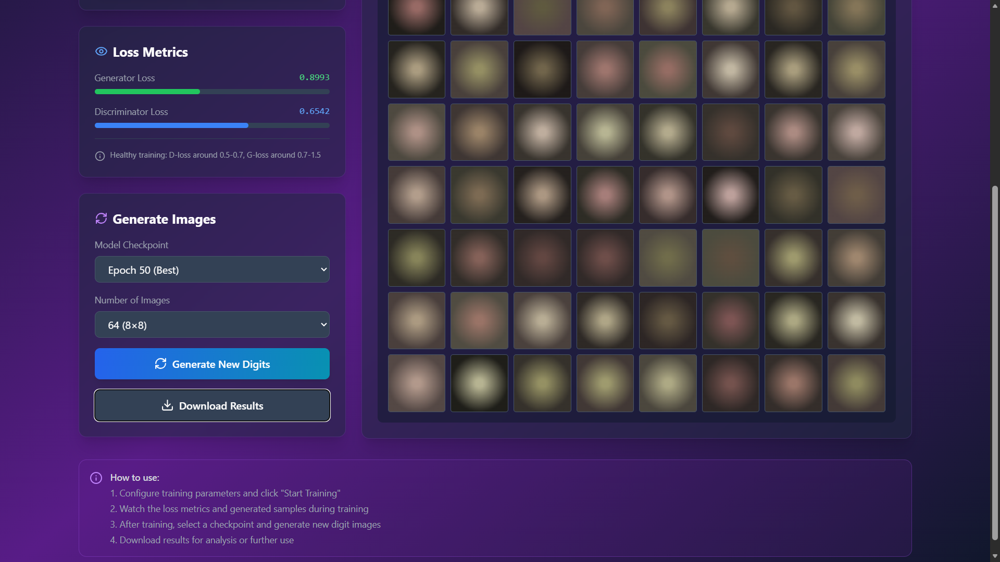
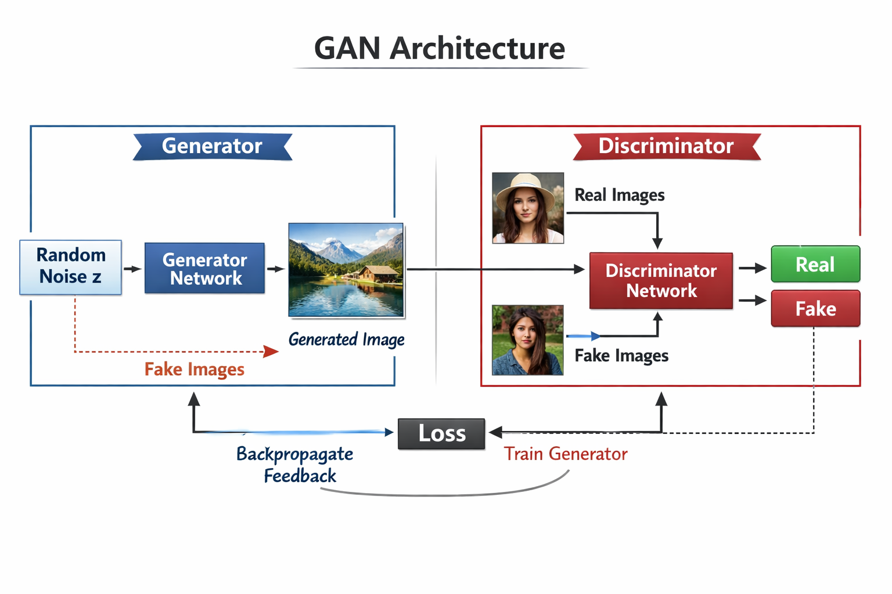
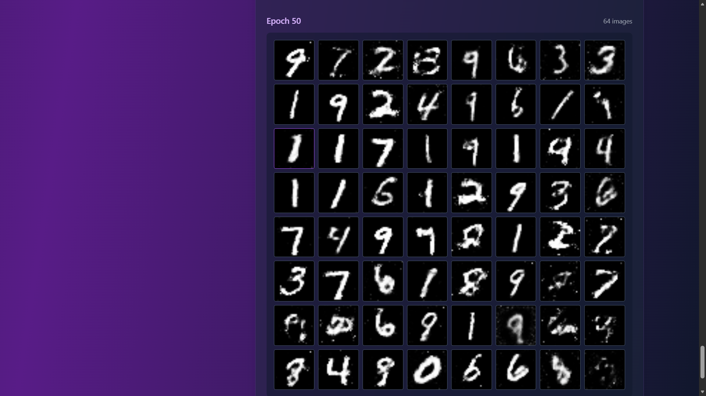
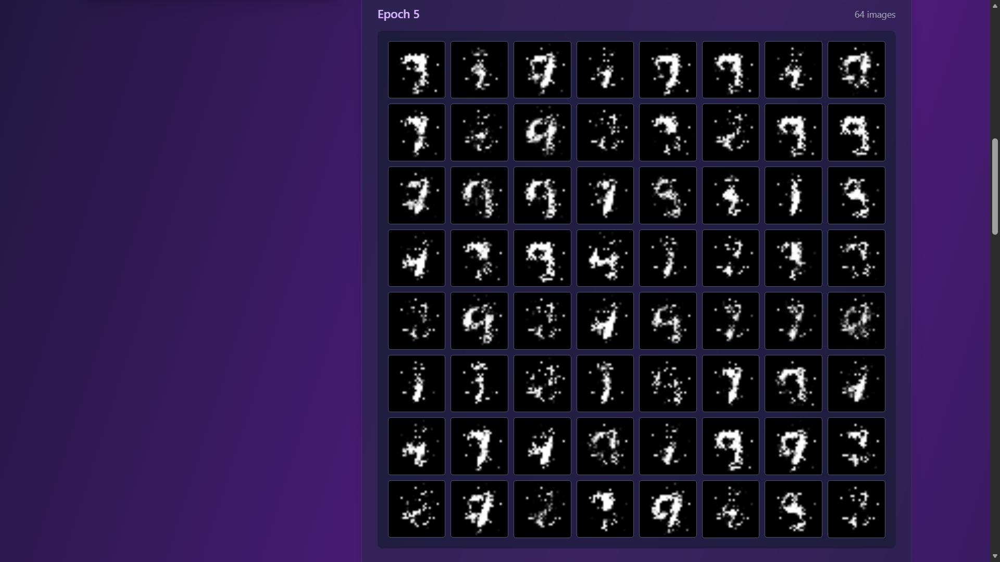
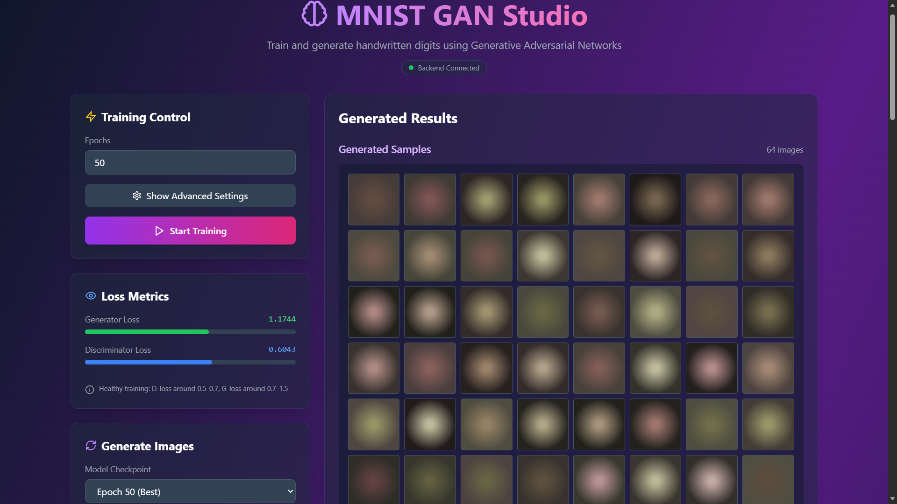

# 🎨 MNIST GAN Studio - Interactive Web Interface

A comprehensive PyTorch implementation of a Generative Adversarial Network (GAN) with a modern web-based interface for training and generating handwritten digits. This project features both command-line scripts and an intuitive web UI for real-time visualization and interaction.


---

## 📋 Table of Contents

- [Overview](#overview)
- [What's New: Web Interface](#whats-new-web-interface)
- [GAN Architecture](#gan-architecture)
- [What This Project Does](#what-this-project-does)
- [Project Workflow](#project-workflow)
- [How GANs Work](#how-gans-work)
- [Features](#features)
- [Requirements](#requirements)
- [Installation](#installation)
- [Project Structure](#project-structure)
- [Usage](#usage)
- [Web Interface Guide](#web-interface-guide)
- [Training Details](#training-details)
- [Results & Progression](#results--progression)
- [Troubleshooting](#troubleshooting)
- [Advanced Configuration](#advanced-configuration)
- [Contributing](#contributing)
- [License](#license)
- [References](#references)

---

## 🎯 Overview

This project implements a **simple feedforward GAN** (Generative Adversarial Network) to generate handwritten digit images, now featuring an interactive web-based interface for real-time training visualization and image generation. The model consists of two neural networks competing in an adversarial game:

- **Generator** 🎨: Creates fake images from random noise vectors
- **Discriminator** 🔍: Distinguishes between real MNIST images and generated fakes

Through adversarial training, the Generator learns to produce increasingly realistic digits that can fool the Discriminator.

### Key Highlights

- ✅ **Interactive Web UI**: Modern, real-time training dashboard with live metrics
- ✅ **Command-Line Scripts**: Traditional Python scripts for automated training
- ✅ **Real-Time Visualization**: Watch generated samples improve during training
- ✅ **Automatic CUDA/GPU acceleration**
- ✅ **Checkpoint saving and resuming**
- ✅ **Loss monitoring with healthy training indicators**
- ✅ **One-click image generation from trained models**
- ✅ **Clean, well-documented codebase**

---

## 🆕 What's New: Web Interface

The project now includes a sophisticated web-based interface built with Flask and Socket.IO for real-time interaction. Here's what the new UI offers:

### Main Interface Components


*Main training interface with real-time loss metrics and generated samples*

**Features visible in the interface:**
- **Training Control Panel**: Configure epochs and start/stop training with one click
- **Real-Time Loss Metrics**: Live visualization of Generator and Discriminator losses
- **Healthy Training Indicators**: Automatic guidance on whether your training is progressing well
- **Generated Samples Grid**: 8×8 grid of samples updated every few epochs
- **Backend Connection Status**: Real-time connection monitoring
- **Model Checkpoint Selection**: Easy switching between different training epochs

### Training Progress Visualization

The interface provides immediate feedback on training quality:


*Progressive improvement of generated digits from early to late epochs*

**Early Training (Epoch 5)**
- Blurry, unrecognizable patterns
- Random noise-like structures
- High generator loss

**Mid Training (Epoch 25)**
- Recognizable digit outlines
- Some clear numbers emerging
- Balanced losses

**Late Training (Epoch 50)**
- Sharp, realistic handwritten digits
- Diverse styles and variations
- Stable, converged losses

### Image Generation Interface


*Post-training generation with model checkpoint selection*

The generation panel allows you to:
- Select any saved model checkpoint
- Choose number of images to generate (16, 36, 64, or 100)
- Generate new digits with one click
- Download results as PNG files
- View high-quality 10×10 grids

---

## 🏗️ GAN Architecture

### Architecture Diagram


*Complete GAN architecture showing data flow between Generator and Discriminator*

The diagram illustrates:
1. **Random Noise Input**: 64-dimensional noise vector (z)
2. **Generator Network**: Transforms noise into 28×28 images
3. **Discriminator Network**: Classifies images as Real or Fake
4. **Adversarial Training Loop**: Backpropagation feedback to improve both networks

### Network Details

**Generator Architecture**
```
Input: Random Noise Vector (64 dimensions)
   ↓
Linear Layer: 64 → 256 neurons
ReLU Activation
   ↓
Linear Layer: 256 → 512 neurons
ReLU Activation
   ↓
Linear Layer: 512 → 784 neurons (28×28 image)
Tanh Activation (outputs in range [-1, 1])
   ↓
Output: Generated 28×28 grayscale image
```

**Discriminator Architecture**
```
Input: Image (28×28 = 784 pixels)
   ↓
Linear Layer: 784 → 512 neurons
LeakyReLU Activation (negative slope = 0.2)
   ↓
Linear Layer: 512 → 256 neurons
LeakyReLU Activation (negative slope = 0.2)
   ↓
Linear Layer: 256 → 1 neuron
Sigmoid Activation (outputs probability 0-1)
   ↓
Output: Real (1) or Fake (0) probability
```

---

## 💡 What This Project Does

This MNIST GAN project accomplishes the following:

### Core Functionality

1. **Learns from Real Data**: Downloads and processes the MNIST dataset containing 60,000 handwritten digit images
2. **Trains Two Competing Networks**: 
   - Generator creates fake digits from random noise
   - Discriminator learns to distinguish real from fake digits
3. **Generates New Digits**: After training, the Generator can create unlimited unique, realistic-looking handwritten digits
4. **Saves Progress**: Automatically saves training checkpoints and generated sample images throughout training
5. **Visualizes Results**: Creates image grids showing the quality improvement of generated digits over time
6. **Interactive Training**: Web interface provides real-time feedback and control

### Use Cases

- **Educational**: Learn how GANs work through a simple, well-documented implementation
- **Data Augmentation**: Generate additional training data for digit recognition tasks
- **Creative**: Produce unique handwritten digit artwork or animations
- **Research**: Serve as a baseline for more advanced GAN experiments
- **Prototyping**: Quick starting point for similar image generation projects
- **Interactive Learning**: Use the web UI to understand training dynamics in real-time

---

## 🔄 Project Workflow

Here's the complete workflow from setup to generation:

```
┌─────────────────────────────────────────────────────────────────────┐
│                        PROJECT WORKFLOW                              │
└─────────────────────────────────────────────────────────────────────┘

1. SETUP PHASE
   ├── Install dependencies (PyTorch, Flask, matplotlib)
   ├── Download MNIST dataset (automatic on first run)
   └── Initialize GPU/CPU device

2. TRAINING PHASE
   ├── OPTION A: Web Interface (app.py)
   │   ├── Launch Flask server
   │   ├── Open browser dashboard
   │   ├── Configure training parameters
   │   ├── Monitor real-time loss metrics
   │   └── View generated samples during training
   │
   └── OPTION B: Command Line (train_gan.py)
       ├── Initialize Generator & Discriminator networks
       ├── Load MNIST data in batches
       ├── For each epoch:
       │   ├── Train Discriminator on real + fake images
       │   ├── Train Generator to fool Discriminator
       │   ├── Log losses
       │   └── Every 5 epochs:
       │       ├── Save checkpoint to checkpoints/
       │       └── Generate sample images to results/
       └── Save final model and images

3. GENERATION PHASE
   ├── OPTION A: Web Interface
   │   ├── Select trained model checkpoint
   │   ├── Choose number of images
   │   ├── Click "Generate New Digits"
   │   └── Download results
   │
   └── OPTION B: Command Line (generate.py)
       ├── Load trained model from checkpoint
       ├── Generate random noise vectors
       ├── Feed noise through Generator
       ├── Create image grids
       └── Save generated samples to results/

4. ANALYSIS PHASE
   ├── Review training progress images
   ├── Compare epoch 5 vs epoch 50 quality
   ├── Check architecture diagrams in resources/
   └── Analyze loss curves for training health
```

### Visual Training Progression


*Visual comparison of generated digits at different training stages*

**Epoch 5**: Initial noise patterns
- Generator Loss: ~1.2
- Discriminator Loss: ~0.6
- Quality: Barely recognizable shapes

**Epoch 25**: Emerging structures
- Generator Loss: ~0.9
- Discriminator Loss: ~0.65
- Quality: Clear digit outlines

**Epoch 50**: High-quality digits
- Generator Loss: ~0.85
- Discriminator Loss: ~0.65
- Quality: Realistic handwritten digits

---

## 🧠 How GANs Work

### The Game Theory Analogy

Think of a GAN as a game between two players:

1. **The Generator (Forger)** 🎨
   - Creates fake money (images)
   - Tries to make them look real
   - Learns from the Detective's feedback

2. **The Discriminator (Detective)** 🔍
   - Examines money to determine if it's real or fake
   - Gets better at spotting fakes over time
   - Forces the Forger to improve

### Training Process Flow

```
                    ┌─────────────┐
                    │ Random Noise│
                    │   Vector z  │
                    └──────┬──────┘
                           │
                           ▼
                    ┌─────────────┐
                    │  Generator  │ ← Learns to create realistic images
                    │   Network   │
                    └──────┬──────┘
                           │
                   Fake Images
                           │
        ┌──────────────────┴──────────────────┐
        │                                      │
        ▼                                      ▼
┌───────────────┐                    ┌─────────────────┐
│  Real Images  │                    │  Fake Images    │
│  from MNIST   │                    │ from Generator  │
│  (Label: 1)   │                    │  (Label: 0)     │
└───────┬───────┘                    └────────┬────────┘
        │                                      │
        └──────────────┬───────────────────────┘
                       │
                       ▼
              ┌─────────────────┐
              │ Discriminator   │ ← Learns to detect fakes
              │    Network      │
              └────────┬─────────┘
                       │
                       ▼
        ┌──────────────┴──────────────┐
        │                              │
        ▼                              ▼
    Real (1)                       Fake (0)
        │                              │
        └──────────┬───────────────────┘
                   │
                   ▼
              ┌─────────┐
              │  Loss   │
              └────┬────┘
                   │
        ┌──────────┴──────────┐
        │                     │
        ▼                     ▼
  Backpropagate          Train Generator
     Feedback
```

### Mathematical Foundation

**Generator Loss (Adversarial Loss):**
```
L_G = -E[log(D(G(z)))]
```
- **Goal**: Maximize the probability that the Discriminator classifies fake images as real
- **Intuition**: Generator wants D(G(z)) to be close to 1 (real)

**Discriminator Loss (Binary Classification):**
```
L_D = -E[log(D(x))] - E[log(1 - D(G(z)))]
```
- **Goal**: Correctly classify real images as real (1) and fake images as fake (0)
- **Intuition**: Maximize confidence on real images, minimize confidence on fake images

### Training Dynamics

The web interface helps visualize these dynamics in real-time:


*Real-time loss monitoring in the web interface*

**Healthy Training Indicators:**
- **Discriminator Loss**: 0.5 - 0.7 (balanced performance)
- **Generator Loss**: 0.7 - 1.5 (actively learning)
- **Loss Stability**: Gradual convergence without wild oscillations

**Warning Signs:**
- **D_loss → 0**: Discriminator too strong, Generator can't learn
- **D_loss → 1**: Generator dominates, possible mode collapse
- **Oscillating Losses**: Training instability, reduce learning rate

---

## ✨ Features

### Core Features

- **Dual Interface Options**: Web UI for interaction, CLI for automation
- **Automatic Dataset Download**: MNIST dataset is downloaded automatically on first run
- **GPU Acceleration**: Automatic CUDA detection and utilization
- **Progress Visualization**: Generated samples saved every 5 epochs
- **Checkpoint System**: Save and resume training from any epoch
- **Memory Efficient**: Optimized batch processing
- **Extensible Architecture**: Easy to modify for other datasets
- **Clean Code**: Well-commented and follows best practices

### Web Interface Features

- **Real-Time Training**: Watch loss metrics update during training
- **Live Sample Preview**: See generated digits improve in real-time
- **Training Control**: Start, stop, and configure training from the browser
- **Model Management**: Easy checkpoint selection and loading
- **One-Click Generation**: Generate new images without writing code
- **Download Results**: Export generated images directly from the interface
- **Responsive Design**: Works on desktop and tablet devices
- **Backend Status**: WebSocket connection monitoring

### Command-Line Features

- **Automated Training**: Set parameters and let it run
- **Batch Processing**: Train multiple models with different configs
- **Script Integration**: Easy to integrate into larger pipelines
- **Resource Efficient**: Minimal overhead compared to web interface

---

## 📦 Requirements

### System Requirements

- **OS**: Linux, macOS, or Windows
- **Python**: 3.8 or higher
- **RAM**: 4GB minimum (8GB+ recommended)
- **Storage**: ~500MB (dataset, checkpoints, and dependencies)
- **GPU** (Optional but recommended): NVIDIA GPU with CUDA support
- **Browser**: Modern browser (Chrome, Firefox, Safari, Edge) for web interface

### Software Dependencies

```
# Core ML Libraries
torch>=2.0.0
torchvision>=0.15.0
numpy>=1.24.0
matplotlib>=3.7.0
Pillow>=9.5.0

# Web Interface
Flask==3.0.0
Flask-CORS==4.0.0
Flask-SocketIO==5.3.5
python-socketio==5.10.0
```

### CUDA Support

For GPU acceleration:
- NVIDIA GPU (GTX 10 series or newer recommended)
- CUDA Toolkit 11.8 or 12.1
- cuDNN (usually comes with PyTorch)

Check CUDA availability:
```bash
python -c "import torch; print(f'CUDA Available: {torch.cuda.is_available()}')"
```

---

## 🚀 Installation

### Step 1: Clone or Download the Repository

```bash
# If using git
git clone https://github.com/yourusername/mnist-gan-studio.git
cd mnist-gan-studio

# Or create a new directory
mkdir gan_project && cd gan_project
```

### Step 2: Install Dependencies

**Option A: Using pip (Recommended)**
```bash
pip install -r requirements.txt
```

**Option B: Using conda**
```bash
conda create -n gan_env python=3.9
conda activate gan_env
pip install -r requirements.txt
```

**Option C: Install with CUDA support**
```bash
# For CUDA 11.8
pip install torch torchvision --index-url https://download.pytorch.org/whl/cu118

# For CUDA 12.1
pip install torch torchvision --index-url https://download.pytorch.org/whl/cu121

# Install remaining packages
pip install Flask Flask-CORS Flask-SocketIO matplotlib numpy Pillow
```

### Step 3: Verify Installation

```bash
python -c "import torch, flask; print(f'PyTorch: {torch.__version__}'); print(f'CUDA: {torch.cuda.is_available()}'); print(f'Flask: {flask.__version__}')"
```

Expected output:
```
PyTorch: 2.0.1
CUDA: True
Flask: 3.0.0
```

---

## 📁 Project Structure

```
mnist-gan-studio/
│
├── README.md                 # This comprehensive documentation
├── requirements.txt          # Python dependencies
├── train_gan.py             # CLI training script
├── generate.py              # CLI generation script
├── app.py                   # Flask web application (NEW!)
│
├── static/                  # Web interface assets (NEW!)
│   ├── css/
│   │   └── style.css        # UI styling
│   ├── js/
│   │   └── app.js           # Frontend logic
│   └── index.html           # Main web interface
│
├── .github/                 
│   └── copilot-instructions.md  
│
├── dataset/                 # Auto-created on first run
│   └── MNIST/              
│       ├── raw/             # Downloaded dataset (60,000 images)
│       └── processed/       # Preprocessed tensors
│
├── resources/               # Documentation and visual resources
│   ├── gan_architecture_diagram.png     # Architecture overview
│   ├── training_progression_ui.png      # UI training progression
│   ├── generation_interface.png         # Generation panel
│   ├── loss_metrics_dashboard.png       # Real-time loss visualization
│   ├── training_stages.png              # Epoch comparison
│   ├── mnist_gan_studio_main.png        # Main interface screenshot
│   ├── generator_network.png            # Detailed Generator
│   ├── discriminator_network.png        # Detailed Discriminator
│   └── sample_outputs/                  # Example results
│       ├── epoch_05_samples.png
│       ├── epoch_25_samples.png
│       └── epoch_50_samples.png
│
├── results/                 # Auto-created: Generated images
│   ├── epoch_5.png          # Early training results
│   ├── epoch_10.png        
│   ├── ...                  # Progressive improvement
│   ├── epoch_50.png         # Final training results
│   ├── final_generated.png  # Best samples
│   └── generated_samples.png # Generated via generate.py
│
└── checkpoints/             # Auto-created: Model states
    ├── checkpoint_epoch_5.pth
    ├── checkpoint_epoch_10.pth
    ├── ...
    └── checkpoint_epoch_50.pth  # Use this for generation!
```

### New Files for Web Interface

#### `app.py` - Flask Application
```python
# Main Flask server with Socket.IO for real-time updates
# Handles:
# - Training management
# - Real-time loss streaming
# - Image generation requests
# - Checkpoint management
```

#### `static/index.html` - Web Interface
```html
<!-- Modern, responsive UI with:
- Training control panel
- Real-time loss visualization
- Generated image grid
- Model checkpoint selector
- Download functionality
-->
```

#### `static/js/app.js` - Frontend Logic
```javascript
// WebSocket communication
// Real-time chart updates
// Image grid rendering
// User interaction handling
```

#### `static/css/style.css` - Styling
```css
/* Modern dark theme with purple accents
   Glassmorphism effects
   Responsive grid layouts
   Smooth animations
*/
```

---

## 🎮 Usage

### Option 1: Web Interface (Recommended for Beginners)

#### Start the Web Server

```bash
python app.py
```

Expected output:
```
 * Running on http://127.0.0.1:5000
 * Running on http://192.168.1.100:5000 (network)
Using device: cuda
GPU: NVIDIA GeForce RTX 3080
```

#### Access the Interface

Open your browser and navigate to:
```
http://localhost:5000
```


#### Training Workflow (Web UI)

1. **Configure Training**
   - Set number of epochs (default: 50)
   - Click "Show Advanced Settings" for more options
   - Review estimated training time

2. **Start Training**
   - Click "▶ Start Training" button
   - Watch real-time loss metrics update
   - Monitor the "Backend Connected" status

3. **Monitor Progress**
   - **Loss Metrics Panel**: Shows Generator and Discriminator losses
   - **Healthy Training Indicator**: Green text confirms balanced training
   - **Generated Samples**: Updates every 5 epochs automatically
   - **Progress Bar**: Visual feedback on training completion

4. **Generate Images**
   - Navigate to "Generate Images" section
   - Select model checkpoint (Epoch 50 recommended)
   - Choose number of images (64 for 8×8 grid)
   - Click "🔄 Generate New Digits"
   - Click "⬇ Download Results" to save

### Option 2: Command Line Interface

#### Training via CLI

```bash
python train_gan.py
```

**What happens:**
1. Downloads MNIST dataset (first run only, ~12MB)
2. Creates directories (dataset/, results/, checkpoints/)
3. Trains for 50 epochs (~5-10 minutes on GPU)
4. Saves checkpoints every 5 epochs
5. Generates sample images to results/

**Expected output:**
```
Using device: cuda
GPU: NVIDIA GeForce RTX 3080
Generator parameters: 533,776
Discriminator parameters: 533,777

==================================================
Starting Training Loop...
==================================================

Epoch [5/50] | Loss D: 0.6234 | Loss G: 0.8912
Epoch [10/50] | Loss D: 0.5821 | Loss G: 1.0234
Epoch [15/50] | Loss D: 0.6102 | Loss G: 0.9456
...
Epoch [50/50] | Loss D: 0.6543 | Loss G: 0.8893

==================================================
Training Complete!
==================================================

Final results saved to: results/final_generated.png
```

#### Generating Images via CLI

```bash
python generate.py
```

**Output:**
- Creates 100 new digit images
- Displays 10×10 grid
- Saves to `results/generated_samples.png`

---

## 🖥️ Web Interface Guide

### Interface Components

#### 1. Training Control Panel


**Features:**
- **Epochs Input**: Set training duration (1-200)
- **Advanced Settings**: Access hyperparameter controls
- **Start/Stop Buttons**: Manage training execution
- **Backend Status**: Real-time connection indicator

**Usage Tips:**
- Start with 50 epochs for first run
- Use 20-30 epochs for quick tests
- 100+ epochs for highest quality results

#### 2. Loss Metrics Dashboard


**Displayed Metrics:**
- **Generator Loss**: Should stabilize around 0.7-1.5
- **Discriminator Loss**: Should stabilize around 0.5-0.7
- **Progress Bars**: Visual representation of loss values
- **Training Health**: Automatic assessment

**Interpreting the Dashboard:**
- **Green Text**: "Healthy training: D-loss around 0.5-0.7, G-loss around 0.7-1.5"
- **Loss Values**: Updated in real-time during training
- **Balanced Losses**: Both networks learning effectively

#### 3. Generated Samples Grid



**Features:**
- **8×8 Grid**: 64 generated samples
- **Auto-Update**: Refreshes every 5 epochs
- **Progressive Improvement**: Visual quality enhancement over time
- **Full-Screen View**: Click to enlarge

**What to Look For:**
- **Early Epochs (5-15)**: Blurry, noisy patterns
- **Mid Epochs (20-35)**: Recognizable digit shapes
- **Late Epochs (40-50)**: Sharp, realistic handwritten digits

#### 4. Image Generation Panel


**Components:**
- **Model Checkpoint Selector**: Choose epoch to load
- **Number of Images**: 64 (8×8) or 100 (10×10)
- **Generate Button**: Create new samples
- **Download Button**: Save results as PNG

**Workflow:**
1. Select "Epoch 50 (Best)" from dropdown
2. Choose "64 (8×8)" for preview or "100 (10×10)" for collection
3. Click "Generate New Digits"
4. Wait for generation (1-2 seconds)
5. Review generated images
6. Click "Download Results" to save

---

## 🎓 Training Details

### Model Architecture Deep Dive

#### Generator Network

**Purpose**: Transform random noise into realistic digit images

**Architecture:**
```python
class Generator(nn.Module):
    def __init__(self):
        super().__init__()
        self.net = nn.Sequential(
            # Layer 1: Expand noise to initial feature space
            nn.Linear(64, 256),       # 64 → 256 neurons
            nn.ReLU(True),            # ReLU activation
            
            # Layer 2: Expand feature space
            nn.Linear(256, 512),      # 256 → 512 neurons
            nn.ReLU(True),            # ReLU activation
            
            # Layer 3: Map to image space
            nn.Linear(512, 784),      # 512 → 784 (28×28 image)
            nn.Tanh()                 # Tanh: outputs in [-1, 1]
        )
```

**Layer-by-Layer Analysis:**

| Layer | Input Dim | Output Dim | Activation | Purpose |
|-------|-----------|------------|------------|---------|
| Linear 1 | 64 | 256 | ReLU | Initial feature extraction |
| Linear 2 | 256 | 512 | ReLU | Feature expansion |
| Linear 3 | 512 | 784 | Tanh | Image reconstruction |

**Why These Activations?**
- **ReLU**: Non-linearity for hidden layers, computationally efficient
- **Tanh**: Output range [-1, 1] matches normalized MNIST data

#### Discriminator Network

**Purpose**: Classify images as real or fake

**Architecture:**
```python
class Discriminator(nn.Module):
    def __init__(self):
        super().__init__()
        self.net = nn.Sequential(
            # Layer 1: Process image input
            nn.Linear(784, 512),           # 784 (28×28) → 512
            nn.LeakyReLU(0.2),            # LeakyReLU with slope 0.2
            
            # Layer 2: Compress features
            nn.Linear(512, 256),           # 512 → 256
            nn.LeakyReLU(0.2),            # LeakyReLU with slope 0.2
            
            # Layer 3: Binary classification
            nn.Linear(256, 1),             # 256 → 1 (probability)
            nn.Sigmoid()                   # Sigmoid: outputs in [0, 1]
        )
```

**Why LeakyReLU?**
- Prevents dying ReLU problem
- Allows gradient flow for negative values
- Standard choice for GAN discriminators

### Hyperparameters Explained

#### Core Parameters

```python
lr = 0.0002              # Learning rate for Adam optimizer
batch_size = 64          # Images per training batch
z_dim = 64               # Noise vector dimension
image_dim = 784          # 28×28 flattened image
num_epochs = 50          # Total training epochs
```

#### Optimizer Configuration

```python
opt_gen = optim.Adam(
    gen.parameters(),
    lr=0.0002,           # Learning rate
    betas=(0.5, 0.999)   # Adam momentum parameters
)

opt_disc = optim.Adam(
    disc.parameters(),
    lr=0.0002,
    betas=(0.5, 0.999)
)
```

**Why beta1 = 0.5?**
- Standard practice for GANs
- Lower momentum for better stability
- Prevents oscillations in adversarial training

### Training Algorithm

#### Two-Step Process

**Step 1: Train Discriminator**
```python
# Generate fake images
noise = torch.randn(batch_size, z_dim)
fake_images = gen(noise)

# Discriminator evaluates real images
disc_real = disc(real_images)
loss_d_real = criterion(disc_real, torch.ones_like(disc_real))

# Discriminator evaluates fake images
disc_fake = disc(fake_images.detach())  # detach() prevents Generator update
loss_d_fake = criterion(disc_fake, torch.zeros_like(disc_fake))

# Combined discriminator loss
loss_d = (loss_d_real + loss_d_fake) / 2
loss_d.backward()
opt_disc.step()
```

**Step 2: Train Generator**
```python
# Generate new fake images (without detach this time)
output = disc(fake_images)

# Generator tries to fool discriminator
loss_g = criterion(output, torch.ones_like(output))  # Want discriminator to output 1

loss_g.backward()
opt_gen.step()
```

### Training Time Estimates

| Hardware | Batch Size | Time per Epoch | Total (50 epochs) |
|----------|------------|----------------|-------------------|
| RTX 4090 | 64 | ~4 seconds | ~3 minutes |
| RTX 3080 | 64 | ~6 seconds | ~5 minutes |
| RTX 2060 | 64 | ~10 seconds | ~8 minutes |
| GTX 1660 | 64 | ~15 seconds | ~12 minutes |
| CPU (i7-12700K) | 64 | ~40 seconds | ~35 minutes |
| CPU (i5-9400F) | 64 | ~60 seconds | ~50 minutes |

### Memory Usage

**GPU VRAM Requirements:**
- **Minimum**: 2GB (batch_size=32)
- **Recommended**: 4GB (batch_size=64)
- **Optimal**: 6GB+ (batch_size=128)

**System RAM:**
- **Training**: ~2-3GB
- **Dataset**: ~200MB (cached in RAM)
- **Web Interface**: +500MB for Flask server

---

## 📊 Results & Progression

### Training Progress Visualization

The quality of generated images improves over time. Check `resources/training_progression.png` for visual comparison.

**Epoch 5**: Noisy, random patterns
```
[Blurry, unclear shapes - see resources/sample_outputs/epoch_05_samples.png]
```

**Epoch 20**: Recognizable digit shapes
```
[Rough outlines of digits emerging]
```

**Epoch 50**: Clear, realistic digits
```
[Well-formed handwritten digits - see resources/sample_outputs/epoch_50_samples.png]
```


*Example of healthy training: balanced losses converging*

### Loss Interpretation

**Healthy Training:**
- Discriminator Loss: 0.5 - 0.7 (balanced)
- Generator Loss: 0.7 - 1.5 (learning)

**Warning Signs:**
- D_loss → 0: Discriminator too strong (Generator can't learn)
- D_loss → 1: Generator fooling Discriminator too easily (mode collapse)
- Losses oscillating wildly: Unstable training (reduce learning rate)

### Sample Outputs

Check the following locations for results:

1. **Training Progress**: `results/epoch_X.png` 
   - 8×8 grids showing improvement at epochs 5, 10, 15, 20, 25, 30, 35, 40, 45, 50

2. **Final Results**: `results/final_generated.png`
   - Best quality samples after complete training

3. **Generated Samples**: `results/generated_samples.png`
   - 10×10 grid created by `generate.py`

4. **Reference Samples**: `resources/sample_outputs/`
   - Example outputs showing expected quality at different epochs

---

## 🔧 Troubleshooting

### Common Issues and Solutions

#### 1. CUDA Out of Memory

**Error:**
```
RuntimeError: CUDA out of memory
```

**Solutions:**
```python
# Reduce batch size in train_gan.py
batch_size = 32  # or even 16
```

#### 2. Module Not Found Error

**Error:**
```
ModuleNotFoundError: No module named 'torch'
```

**Solution:**
```bash
pip install torch torchvision matplotlib numpy
```

#### 3. CUDA Not Available

**Error:**
```
Using device: cpu
```

**Solutions:**
- Check if you have an NVIDIA GPU: `nvidia-smi`
- Install CUDA-enabled PyTorch:
  ```bash
  pip install torch torchvision --index-url https://download.pytorch.org/whl/cu118
  ```
- Verify CUDA installation: `nvcc --version`

#### 4. Poor Quality Generated Images

**Symptoms:**
- Images look random even after 50 epochs
- All images look the same (mode collapse)
- Results don't match `resources/sample_outputs/`

**Solutions:**
1. Train longer (100-200 epochs)
2. Adjust learning rate:
   ```python
   lr = 0.0001  # Lower learning rate
   ```
3. Use label smoothing:
   ```python
   real_labels = torch.ones_like(disc_real) * 0.9  # Instead of 1.0
   fake_labels = torch.zeros_like(disc_fake) + 0.1  # Instead of 0.0
   ```
4. Compare your loss curves with `resources/loss_curves.png`

#### 5. Training Takes Too Long on CPU

**Solution:**
Consider using:
- Google Colab (free GPU)
- Kaggle Notebooks (free GPU)
- AWS/Azure GPU instances
- Reduce `num_epochs` to 20-30 for faster results

#### 6. Dataset Download Fails

**Error:**
```
HTTP Error 503: Service Unavailable
```

**Solution:**
Manually download MNIST from: http://yann.lecun.com/exdb/mnist/
- Place files in `dataset/MNIST/raw/`
- Set `download=False` in code

#### 7. Checkpoint File Not Found

**Error:**
```
FileNotFoundError: checkpoints/checkpoint_epoch_50.pth
```

**Solution:**
- Ensure training completed successfully
- Check `checkpoints/` directory for available epochs
- Update `generate.py` to use existing checkpoint:
  ```python
  checkpoint_path = 'checkpoints/checkpoint_epoch_45.pth'  # Use available epoch
  ```

---

## ⚙️ Advanced Configuration

### Modify Hyperparameters

Edit `train_gan.py`:

```python
# Experiment with these values
lr = 0.0001              # Lower = more stable, slower
batch_size = 128         # Higher = faster, needs more VRAM
z_dim = 128              # Higher = more expressive generator
num_epochs = 100         # Train longer for better results
```

### Add Learning Rate Scheduling

```python
from torch.optim.lr_scheduler import StepLR

# After optimizer initialization
scheduler_gen = StepLR(opt_gen, step_size=30, gamma=0.5)
scheduler_disc = StepLR(opt_disc, step_size=30, gamma=0.5)

# In training loop (after optimizer.step())
scheduler_gen.step()
scheduler_disc.step()
```

### Monitor Training with TensorBoard

```python
from torch.utils.tensorboard import SummaryWriter

writer = SummaryWriter('runs/gan_experiment')

# In training loop
writer.add_scalar('Loss/Generator', loss_g.item(), epoch)
writer.add_scalar('Loss/Discriminator', loss_d.item(), epoch)
writer.add_images('Generated', fake, epoch)

# View with: tensorboard --logdir=runs
```

### Use Convolutional Layers (DCGAN)

For better image quality, upgrade to convolutional architecture. Reference `resources/gan_architecture_diagram.png` for guidance:

```python
class Generator(nn.Module):
    def __init__(self):
        super().__init__()
        self.main = nn.Sequential(
            nn.ConvTranspose2d(z_dim, 256, 7, 1, 0, bias=False),
            nn.BatchNorm2d(256),
            nn.ReLU(True),
            nn.ConvTranspose2d(256, 128, 4, 2, 1, bias=False),
            nn.BatchNorm2d(128),
            nn.ReLU(True),
            nn.ConvTranspose2d(128, 1, 4, 2, 1, bias=False),
            nn.Tanh()
        )
```

---

## 🤝 Contributing

Contributions are welcome! Here's how you can help:

### Ways to Contribute

1. **Report Bugs**: Open an issue with details
2. **Suggest Features**: Propose new ideas or improvements
3. **Submit Pull Requests**: Fix bugs or add features
4. **Improve Documentation**: Help make this README better
5. **Share Results**: Post your generated images in `resources/sample_outputs/`!
6. **Add Visual Resources**: Create diagrams or visualizations for the `resources/` folder

### Development Setup

```bash
# Fork and clone the repository
git clone https://github.com/yourusername/simple-gan-mnist.git

# Create a new branch
git checkout -b feature/your-feature-name

# Make changes and commit
git commit -m "Add: your feature description"

# Push and create a pull request
git push origin feature/your-feature-name
```

---

## 📄 License

This project is licensed under the MIT License.

```
MIT License

Copyright (c) 2025

Permission is hereby granted, free of charge, to any person obtaining a copy
of this software and associated documentation files (the "Software"), to deal
in the Software without restriction, including without limitation the rights
to use, copy, modify, merge, publish, distribute, sublicense, and/or sell
copies of the Software, and to permit persons to whom the Software is
furnished to do so, subject to the following conditions:

The above copyright notice and this permission notice shall be included in all
copies or substantial portions of the Software.

THE SOFTWARE IS PROVIDED "AS IS", WITHOUT WARRANTY OF ANY KIND, EXPRESS OR
IMPLIED, INCLUDING BUT NOT LIMITED TO THE WARRANTIES OF MERCHANTABILITY,
FITNESS FOR A PARTICULAR PURPOSE AND NONINFRINGEMENT.
```

---

## 📚 References

### Original Papers

- **GANs**: [Generative Adversarial Networks (Goodfellow et al., 2014)](https://arxiv.org/abs/1406.2661)
- **DCGAN**: [Unsupervised Representation Learning with Deep Convolutional GANs (Radford et al., 2015)](https://arxiv.org/abs/1511.06434)

### Useful Resources

- [PyTorch Official Documentation](https://pytorch.org/docs/stable/index.html)
- [MNIST Dataset](http://yann.lecun.com/exdb/mnist/)
- [GAN Hacks - How to Train a GAN](https://github.com/soumith/ganhacks)
- [PyTorch Tutorials](https://pytorch.org/tutorials/)

### Tutorials

- [Understanding GANs (Distill.pub)](https://distill.pub/)
- [A Beginner's Guide to GANs](https://wiki.pathmind.com/generative-adversarial-network-gan)
- [PyTorch DCGAN Tutorial](https://pytorch.org/tutorials/beginner/dcgan_faces_tutorial.html)

---

## 🌟 Acknowledgments

- **MNIST Dataset**: Yann LeCun, Corinna Cortes, Christopher J.C. Burges
- **PyTorch Team**: For the excellent deep learning framework
- **Ian Goodfellow et al.**: For inventing GANs

---

## 📞 Contact & Support

- **Issues**: [GitHub Issues](https://github.com/abhinav-e-p-b/MNIST-GAN-Project/issues)
- **Discussions**: [GitHub Discussions](https://github.com/abhinav-e-p-b/MNIST-GAN-Project/discussions/1)
- **Email**: abhinavepb92@gmail.com

---

## 🎉 Quick Start Summary

```bash
# 1. Install dependencies
pip install torch torchvision matplotlib numpy

# 2. Train the model
python train_gan.py

# 3. Generate new images
python generate.py

# 4. Check results
# - Training progress: results/epoch_X.png
# - Final samples: results/final_generated.png
# - Reference materials: resources/
```

That's it! You should see generated MNIST digits improving over time. Compare your results with the samples in `resources/sample_outputs/` to ensure proper training.

---

**Happy Training! 🚀**

If this project helped you, please consider giving it a ⭐ on GitHub!

For visual learners, check out the architecture diagrams and sample outputs in the `resources/` folder!